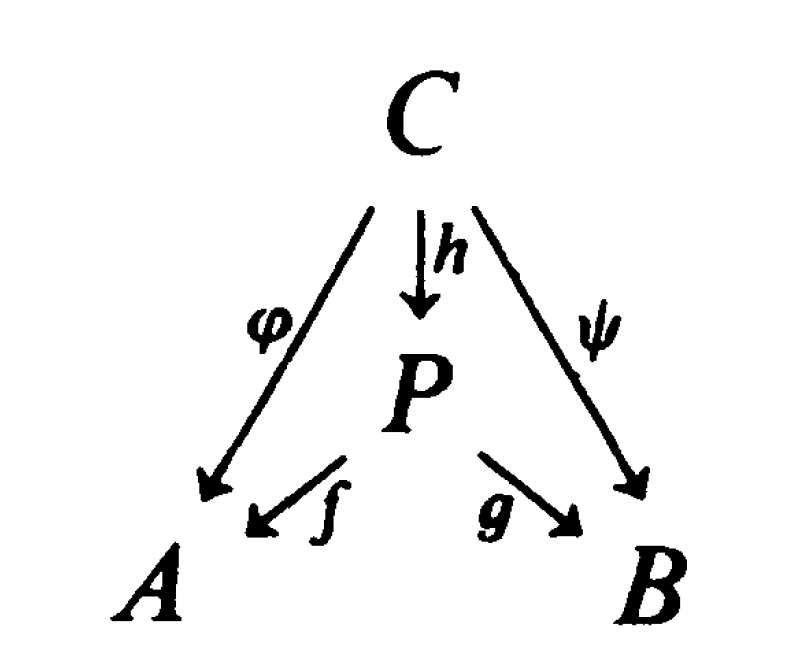
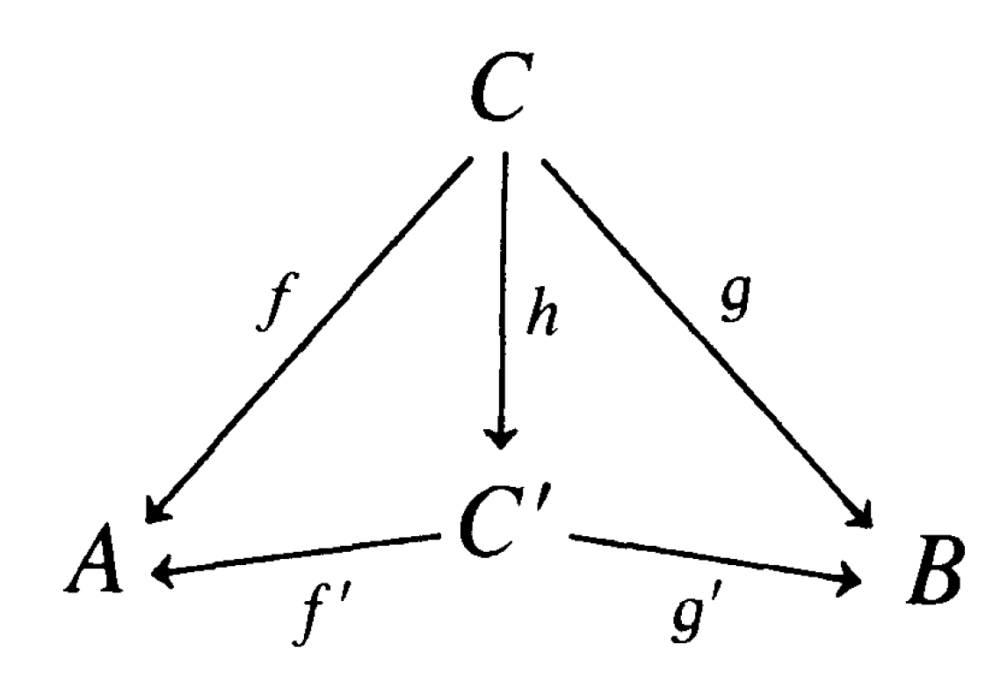
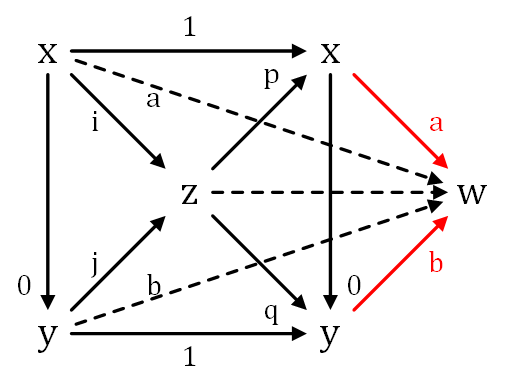

# 范畴论

一个范畴(category)$\mathcal{C}$包含一系列的(这里的术语“一系列的”暗指可能不能用集合来约束这类对象，因为所有的集合连同集合间的映射也可以看做一个范畴)对象(object)$\text{Ob}(\mathcal{C})$和箭头(arrows)$\text{Ar}(\mathcal C)$；对任意的$\text{Ob}(\mathcal{C})$中的元素A和B，存在$\text{Ar}(\mathcal C)$中的集合$\text{Mor}(A, B)$，称作A到B的态射(morphisms)；给定$A, B, C \in \text{Ob}(\mathcal C)$，存在一个运算(law of composition)将$\text{Mor}(B, C) \times \text{Mor}(A, B) \to \text{Mor}(A, C)$。此外对于态射和态射的运算满足下面三条公理：

+ $\text{Mor(A, B)} \cap \text{Mor}(A', B') \ne \empty \Leftrightarrow A'=A, B' = B$。
+ 对任意的$A, B\in \text{Ob}(\mathcal C)$，存在一个$\text{id}_A \in \text{Mor}(A, A)$， 其（在相应的运算中）是$\text{Mor}(A, B)$的__右__单位元和$\text{Mor}(B, A)$的__左__单位元
+ 关于态射的运算时可结合的。给定$f \in \text{Mor}(A, B), g \in \text{Mor}(B, C), h \in \text{Mor}(C, D)$，有$(f \circ g )\circ h = f \circ (g \circ h)$

绝大多数情况下，$\text{Ob}(\mathcal C)$中的都是集合而$\text{Mor}(\mathcal C)$中的都是集合之间的某些映射。

__范畴论的一个重要的思路就是将所有的结构都通过对象和箭头的约束来构造__

给定$A, B \in \text{Ob}(\mathcal{C})$，自然地可以定义$A \to B$(即$\text{Mor}(A, B)$中的元)的同构(isomorphism)$f$，如果$\exist g : B \to A$使得$f \circ g = \text{id}_A$且$f \circ g = \text{id}_B$。如果A = B，则这样的$f$被成为自同构(automorphism)。立刻可以得到自同构关于态射运算是一个群。所谓"表示论"就是研究给定一个群$G$其到某个对象A的自同构群$\text{Aut}(A) $中的（群）同构。此外还可以得到$\text{End}(A) := \text{Mor}(A, A)$为一个幺半群。

一个群在某个范畴中的表示本身也构成一个范畴：令$\rho, \rho'$是G到$\text{Aut}(A), \text{Aut}(A')$的表示，则$\rho$到$\rho'$的态射可以定义为使得下述表格对所有$x \in G$可交换的$h \in \text{Mor}(A, A')$：
$$
\def \obc{\text{Ob}(\mathcal{C})}
\def \mor#1#2{\text{Mor}(#1, #2)}
\def \arc{\text{Ar}(\mathcal C)}
\def \catc{\mathcal C}
\def \catb{\mathcal B}
\def \cat#1{\mathcal #1}
\def \ob#1{\text{Ob}(\mathcal #1)}
\begin{CD}
A @>h>> A' \\
@V\rho(x) VV @VV\rho'(x)V \\
A @>h>> A'
\end{CD}
$$

令$\mathcal C, \mathcal B$为两个范畴，一个$\mathcal C$到$\mathcal B$协变函子$F$是这样一个法则，其将每个$\obc$中的元素A映射到$\text{Ob}(\catb)$中的某个元素$F(A)$，同时将每个$\mor{A}{B} \in \arc$中的元素映射到某个$\mor{F(A)}{F(B)}$中的元素满足：

+ $\forall A \in \obc,F(\text{id}_A) = \text{id}_{F(A)}$
+ 给定$f:A\to B$和$g: B \to C$为$\catc$中的两个态射，则$F(gf) = F(f)F(g)$

如果上面的第二条变成$F(gf) = F(f)F(g)$，则称F为逆变函子。

称一个函子是可信的(faithful)，如果对于任意的$x, y \in \ob{A}$，相应的映射$\mor x y \to \mor{F(x)}{F(y)}$是单射。如果$\mor x y \to \mor {F(x)}{F(y)}$事实上还是满射，则称函子是完全可信的(fully faithful)

如果$F, G$都是$\cat A \to \cat B$的函子，有一种自然的方式定义它们之间的态射。一个$F \to G$的态射是一系列$\{t_x\}_{x \in \ob A}$(注意每一个x都应该取到！)其中$t_x: F(x) \to G(x)$是$\cat B$中的态射，满足$\forall \phi:x\to y$($\phi$是$\cat A$中的态射)，有可交换表格：
$$
\begin{CD}
F(x) @>t_x>>  G(x) \\
@VF(\phi)VV @VVG(\phi)V \\
F(y) @>t_y>> G(y)
\end{CD}
$$
可以方便地验证态射是可结合的同时每个F都有到自己的恒等态射，故函子本身实际上也构成一个范畴

## Yoneda 引理

### 预束

给定范畴$\cat C$，C上的一个预束是指从$\cat C$到集合范畴的一个逆变函子。所有关于$\cat C$的预束构成的范畴记做$PSh(\cat C)$。一个例子是所谓点函子(functor of points)：给定任意的$U \in \obc$，考虑函子
$$
\begin{align}
h_U :\ &  \cat C \to Sets \\
& X \mapsto \mor X U
\end{align}
$$
给定任意的$f : X \to Y$，$h_U(f)$将$\mor Y U$映射到$\mor X U $中：对任意的$\phi \in \mor Y U$，$h_U(f)(\phi) = \phi \circ f$。

点函子的另一个特性是， 给定$\cat C$中U到V的一个态射$\phi: U \to V$可以得到一个$h_U \to h_V$的函子的态射。参考上面的函子态射的定义，这里的$t_x: h_U(X) \to h_V (X)$就定义为$t_x(\psi) = \phi \circ \psi$。从而实际上得到了一个$\cat C$到$PSh(\cat C)$上的函子，记做$h$

### 引理陈述

Yoneda引理说的是上面定义的函子$h$是完全可信的。即对于任意的函子态射$s:h_U \to h_V$，存在唯一的$\cat C$中的态射$\phi: U \to V$使得$h(\phi) = s$。

证明：令$\tau = s_U(\text{id}_U)$，右边记号的意思是，$s_U$如上面函子态射中的$t_x$是__集合__$h_U(U)\to h_V(U)$中的映射，而$h_U(U) = \mor U U$至少包含了$\text{id}_U$，从而$\tau$是有定义的。下面考察对于任意的$X$，$s_X$在$h_U(X)$上的作用效果。考虑下面的可交换表格：
$$
\begin{CD}
h_U(U) @>s_U>> h_V(U)\\
@Vh_U(\phi)VV @VV{h_V(\phi)}V\\
h_U(X) @>s_X>> h_V(X)
\end{CD}
$$
固定$\text{id}_U\in h_U(U)$而变化$\phi \in \mor X U$，根据表格的可交换性可以得到$\phi \circ s_U(\text{id}_U) = s_X(\phi)$。将$\phi$取遍$\mor X U$事实上就得到了$s_X $在$h_U(X) = \mor X U$上的作用。而这样定义的$s$确实是函子之间的态射，从而证明了完全可信性质。

一般地，给定任意的$F\in PSh(\cat C)$，存在$\mor{h_U}{F}$和$F(U)$之间的自然的一一对应（注意$F(U)$同样是集合）。也是借助上面固定$\text{id}_U$而改变$\phi \in \mor X U$来得到$s_X$在$h_U(X)$上的作用:$s_X(\phi) = F(\phi)(s_U(\text{id}_U))$
$$
\begin{CD}
h_U(U) @>s_U>>F(U)\\
@Vh_U(\phi)VV @VV{F(\phi)}V\\
h_U(X) @>s_X>> F(X)
\end{CD}
$$
如果$F \in PSh(\cat C)$同构于某个$h_u$，则称F是可表示的。如果$F \cong h_U, F\cong h_V$，则$h_U \cong h_V$，从而存在一个$U \to V$和$V \to U$的态射诱导$h_U$和$h_V$之间的同构，这两个映射的复合诱导了单位映射，从而复合本身也是单位映射（Yoneda引理）。故U和V同构。

给定一个可表示的函子F，设$F \cong h_U$，则$ \xi = s_U(\text{id}_U) \in F(U)$有这样的特性，由其诱导的映射
$$
\mor V U \to F(V), (f:V \to U) \mapsto F(f)(\xi)
$$
是一个双射。反过来这个性质也可以决定F是否是可表示的：只要找到某个$F(U)$使得其中存在这样的$\xi$即可，注意到上面给出的映射实际上就是集合范畴的一个同构（双射）。

 

## 次可加范畴

### 初始对象，终止对象，零元素

一个范畴中的初始对象(initial object)是这样一个元素，它到任意一个$\text{Ob}(\mathcal C)$中的元素的态射有且仅有一个。终止对象(terminal object)则是任意$\text{Ob}(\mathcal C)$中的元素到它的映射有且仅有一个。立刻可以得到一个范畴中的任意两个初始对象或者万有对象是同构的。（Serge Lang的书上将初始对象称为universal repelling，将终止对象称为universal attracting）

### 积与协积

积(product)与协积(coproduct)：给定$A, B \in \text{Ob}(\mathcal{C})$，定义A与B的（在$\text{Ob}(\mathcal{C})$中的）积是一个三元组$(P, f, g)$其中$P \in \obc$，而$f \in \mor{P}{A}, g \in \mor{P}{B}$使得给定两个态射$\phi: C \to A, \psi : C \to B$，存在唯一的态射$h: C \to P$使得$\phi = f h, \psi = gh$。

这个定义可以方便地扩展到任意多个对象的积。通常的集合或者群的积都满足这个定义。事实上所有像上面那样的C和$\phi, \psi$构成的三元组可以看作某个范畴中的对象，而这些对象间的映射就是使得下述表格可交换的原先范畴箭头集中的元h：什么时候积和协积一致 

A与B的乘积实际上就是这个新定义范畴中的终止对象。

如果在上面的关于积的定义中将所有的箭头反向，就得到协积的定义。最直接的一个例子就是模上的张量积。一个更加简单的例子可以定义在集合范畴：给定$S, S'$为集合，令T是和$S'$等势的与S不交的集合，令$f_1: S \to S$为恒等映射，$f_2: S' \to T$为相应的双射，则$(S \cup T, f_1, f_2)$即为这两个集合的一个协积。这个协积也被称作分离并（disjoint union）

### 核及协核

对于次可加范畴$\cat C $，因为态射本身都具有0元，所以方便进行定义核以及协核，像集等概念

+ 态射$f: x \to y$的核(kernel)是一个态射$i : z \to x$使得$f \circ i = 0$且对于任意的$i' : z' \to x$使得$fi' = 0$，存在唯一的$g: z' \to z$使得$i' = ig$。如果这样的核存在，将其记为$\ker(f) \to x$
+ $f:x \to y$的一个协核(cokernel)是态射$p: y \to z$使得$p\circ f = 0$且对于任意的$p': y \to z'$使得$p'f = 0$，存在唯一的$g: z\to z'$使得$p' = gp$。这样的协核若存在则记为$y \to \text{coker}(f)$
+ 如果$f$的核存在，则f的协像(coimage)是态射$\ker(f) \to x$的协核
+ 如果$f$的协核存在，则f的像(image)是态射$y \to \text{coker}(f)$的核

借助于Yoneda引理，可以得到上面定义的核，协核，协像，像都是同构的。以核为例。考察定义在$\cat C$上的预束$F$。$F(z) = \ker (\mor z x \to \mor z y)$，括号中的映射将$s \mapsto fs$，上面的定义说明$i \in F(z)$具有诱导任意$h_z(z')$和$F(z')$之间双射的性质，所以事实上F被z所表示。

### 单射和满射

范畴论中的单射(monomorphism)是所谓左消去函子。$f: x \to y$为单射，如果对于任意的$g_1, g_2: z \to x$有$fg_1 = fg_2 \Rightarrow g_1 = g_2$。

类似地，如果对于任意的$h_1, h_2: y \to z$有$h_1f = h_2 f \Rightarrow h_1 = h_2$。

注意到如果一个映射是核，则其自然是单射；如果是协核，则自然是满射。

一个单射被称为正规(normal)的，如果它是某个态射的核；一个满射是协正规（conormal）的，如果它是某个态射的协核。如果所有的单射是正规的且所有的满射是协正规的，则称这个范畴是正规的。

### 次可加范畴及其性质

这个部分的资料参考[columbia.edu](https://stacks.math.columbia.edu/tag/09SE)的一个链接

一个范畴$\mathcal A$被称为次可加的（preadditive），如果每一个$\mor{A}{B}$本身还是一个阿贝尔群且态射的复合运算是双线性的（特别地可以看到，每一个$\mor{A}{B}$中至少有一个元素）。函子$F:\mathcal A \to \mathcal B$被称为可加(additive)的，如果对于任意的$\mor A B$，F诱导的$\mor A B \to \mor{F(A)}{F(B)}$的态射映射还是一个阿贝尔群同态。

在这样一个次可加范畴中，初始对象和终止对象其实是同一个元素。给定$\mathcal A$为一个范畴，$x \in \text{Ob}(\mathcal A)$，则下列表述等价：

+ $x$为起始对象
+ $x$为终止对象
+ $\text{id}_x = 0$

如果第1条或者第2条成立，则$\mor{x}{x}$中事实上只有一个元素，从而是平凡阿贝尔群，这个元素就是$\text{idx}_x$。如果第3条成立，为了证明$x$是起始的，只要证明$\mor{x}{A}$中的所有元素都是0即可。给定$f \in \mor{x}{A}$，考虑映射复合$C:\mor x x \times \mor x A \to \mor x A$，则$f = C(0, f)$，由映射的双线性性可以得到$f = 0$。

对于次可加范畴，如果存在一个万有对象，则将这个对象记为0.

给定次可加范畴$\cat A$，对于任意的$x , y \in \ob A$，两个对象的积和协积只要一个存在则另一个必然存在且积和协积同构。

给定x和y的一个积(z, p, q)，考虑将$\text{id}_x$以及$\mor x y$中的0元素，由于z是积存在一个$i:x \to z$使得$pi = \text{id}_x, qi = 0$，同理存在$j:y \to z$使得$qj = \text{id}_y, pj = 0$，则$(z, i, j)$实际上就是协积。为了说明这一点，给定一个$w$以及$a:x \to w, b: y \to w$，考察$\phi: z \to w$定义为$\phi = ap + bq$。则
$$
\phi i = (ap + bq)i = api + bqi = a \text{ id}_x + b0 = a
$$
注意上面用到了双线性性，结合律以及id作为单位元的性质。同理有$\phi j = b$。对于次可加范畴，这样的积（或者协积）称为直和。

如果$\cat A, \cat B$都是次可加范畴，$F: \cat A \to \cat B$是可加函子，则上面的关于0元和直和的证明过程作用上F之后同样有效，即F保持0元和直和。可加范畴(additive category)被定义为包含所有__有限__乘积以及0元的范畴。

## 正合函子

### 阿贝尔范畴

一个范畴被称为阿贝尔范畴(abelian category)，如果其是一个次可加范畴，存在零元，存在所有的直和，存在所有的核以及协核，所有的单射和满射都是正规的。

### 正合函子

所谓可加函子(additive functor)是定义在次可加范畴$\cat A, \cat B $上的函子$F : \cat A \to \cat B$，对于任意的$A, B \in \cat A$，由F诱导的$\mor A B \to \mor{F(A)}{F(B)}$的映射同样是一个群同态。

对于阿贝尔范畴，同样可以定义正合序列：$A \xrightarrow{f} B \xrightarrow{g}C$是正合的意味着$\text{img }f = \ker g$

正合函子就是保持正合序列的可加函子。

