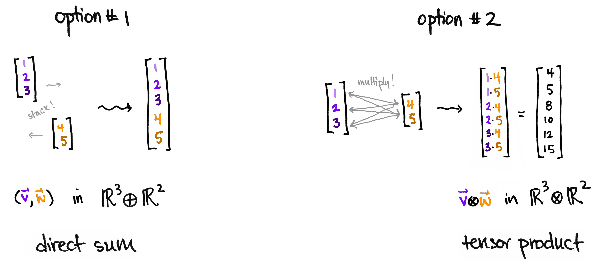

# 借助向量空间的解释

https://www.math3ma.com/blog/the-tensor-product-demystified 给出了一个非常通俗易懂的解释说明。首先张量本身是一种构造新空间的方法。如果给定两个向量，有两种可行的方式来构造一个新向量：堆叠或者（以完全图的方式）相乘。第二种方式其实就暗含了新向量的基底：原先的两个空间的基底两两配对构成新的基底。

该博客还简要介绍了在量子力学中的应用：如果单个粒子的状态被通过一个向量来描述，那么张量被用来描述多个粒子系统的状态。

# 更为严格的表述

http://www-users.math.umn.edu/~garrett/m/algebra/notes/27.pdf

如果S是一个R上的代数，M是一个R模，$S\otimes M$实际上是一个S模。

单张量(mono-tensor)生成整个张量积不仅仅需要对于特定的存在性构造进行证明，而是需要借助映射万有性质对所有的tensor-product进行证明。

多线性型的映射性质给出了多个模的张量积的定义，多个模的张量积可以借助依次张量积得到，具体结合方式可以是任意的，因为张量积满足结合律（证明它们都具有多线性性的映射性质）

通常情况下在计算的时候不要去尝试给出张量的关系。尽管在知道各个分量的情况下，生成元还是可以给出的。一个计算的例子是证明$\Z/a \otimes \Z /b \cong \Z/\gcd(a,b) $。首先考虑其只有一个生成元。并注意到$\gcd(a,b)$是零化子。最后构造一个从$\Z/a \times \Z/b \to \Z/\gcd(a,b) $的满射即可。

为了更好地讨论张量积的函子性质，首先考虑映射的张量积：给定$f:M\to M', g:N \to N'$，定义$f\otimes g$满足：
$$
(f\otimes g)(m \otimes n) = f(m) \otimes g(n)
$$
良定义性质的证明首先考虑$M \times N \to M'\otimes N'$的映射
$$
B(m, n) = \tau'(f(m), g(n)) = f(m) \otimes g(n)
$$
其中$\tau'$是$M'\times N' \to M' \otimes N'$的张量映射。这样B就是良定义的且具有双线性性。从而可以由B诱导一个$M\otimes N \to M'\otimes N'$的映射$f\otimes g $使得
$$
(f \otimes g)(m \otimes n)=(f\otimes g)(\tau(m, n)) = B(m, n) = f(m)\otimes f(n)
$$
__上述__$f \otimes g$__的良定义性质证明的启发是，并不一定真的根据对mono-tensor的作用来定义函数，只是说定义了某个函数在mono-tensor上的作用满足上述要求。通过在乘积上的另一个函数来定义在张量积上的函数（事实上满足这样性质的函数也是唯一的）__

作为一个应用，可以证明当S为一个R代数，M为一个R模时，$M \otimes S$确实是一个S模。对每一个$s_0 \in S$，定义R模同态$\phi_{s_0}: M \otimes S \to M \otimes S$使得$\phi_{s_0}(m\otimes s) = m\otimes (ss_0)$，同时可以证明$\phi_{s_0+s_1} = \phi_{s_0} + \phi_{s_1}$，于是$\phi_s$实际上就定义了s对$M\otimes S$上元素的乘法。

## 标量的扩张

关于标量的扩张，即将一个R模以某种方式扩展成一个S模，S是一个R代数，形式化的应该表述成一个从R模范畴到S模范畴的函子F，这个函子应该满足：
$$
\newcommand{\Hom}{\text{Hom}}
\Hom_S(FM, N) \cong \Hom_R(M, N)
$$
其中N是一个S模。右侧的N被看作R模，有时也写作$\text{Res}_R^S N$。不严格地说，就是在标量扩展之后的FM到某个S模的同态完全由M到N的同态给出。__注意和commutative algebra的proposition 2.10进行比较。__同构（记作$i_{M,N}$）同样需要满足某种“自然的”交换性要求
$$
\begin{CD}
\Hom_S(FM, N) @>i_{M,N}>> \Hom_R(M, N) \\
@V{g\circ-}VV @V{g\circ -}VV\\
\Hom(FM, N') @>i_{M, N'}>> \Hom_R(M, N')
\end{CD}

\begin{CD}
\Hom_S(FM, N) @>i_{M,N}>> \Hom_R(M, N) \\
@V{-\circ Ff}VV @V{-\circ f}VV\\
\Hom(FM', N) @>i_{M, N'}>> \Hom_R(M', N)
\end{CD}
$$
其中$g: N\to N', f: M \to M'$。$g\circ -$表示后作用g，其它的类似。实际上这两个表格说明$i_{M, N}$是关于N的函子$\Hom_S(FM, -)$到$\Hom_R(M, -)$的映射，也是关于M的函子$\Hom_S(F-, N)$到$\Hom_R(-, N)$的映射。

这样的F的一个例子就是与S做张量积。即存在$\Hom_S(M\otimes S, N)$与$\Hom_R(M, N)$之间的同构$i_{M, N}$。$i_{M, N}$定义为$i_{M, N}(\phi)(m) = \phi(m \otimes 1)$，$i_{M, N}$的逆映射$j_{M, N}$定义为$j_{M,N}(\phi)(m\otimes s) = s\phi(m)$

## 代数张量积

给定R和一个R代数S，则$R[x]\otimes S\cong S[x]$。这里的同构是作为环的同构而不仅仅是作为模。首先注意到左侧确实可以定义乘法。乘法的定义思路还是借助张量积的映射性质找到一个双线性$F: (R[x] \otimes S) \times (R[x] \otimes S) \to R[x] \otimes S$使得$F(f_1\otimes s_1, f_2\otimes s_2)=f_1f_2\otimes s_1s_2$。F的双线性性质蕴含着可以满足分配律。而交换律是不言自明的。进一步，R的单变量的多项式R[x]环具有如下的万有性质：对于任意给定的R代数:$\phi: R\to A$以及$a\in A$，存在唯一的环同态$\Phi: R[x] \to A$使得$\Phi(x) = a$。借助于R[x]的万有性质和张量积的映射性质可以得到$R[x]\otimes S$具有$S[x]$的万有性质，从而两者同构。

上面的两个代数做张量积的方式可以扩展到一般的情形。